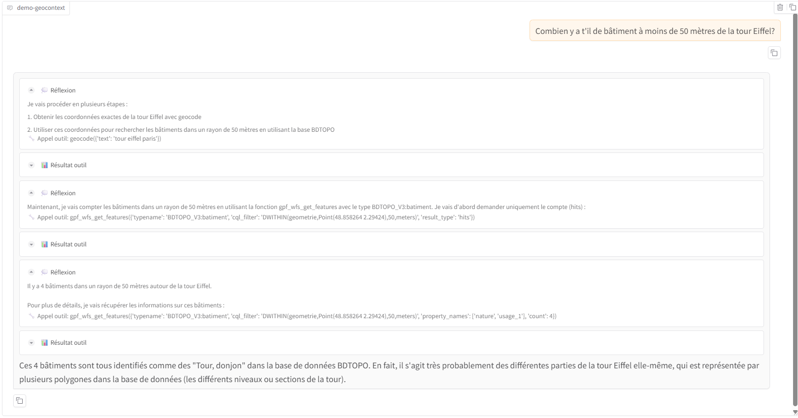

# demo-geocontext

Interactive demo for [ignfab/geocontext](https://github.com/ignfab/geocontext#readme) based on [Gradio - ChatBot](https://www.gradio.app/guides/creating-a-chatbot-fast) and  [LangGraph](https://langchain-ai.github.io/langgraph/agents/mcp/#use-mcp).

## Screenshot



## Requirements

* [uv](https://github.com/astral-sh/uv#installation) ( Python package and project manager )
* [NodeJS (npx)](https://docs.npmjs.com/downloading-and-installing-node-js-and-npm)

## Parameters

| Name              | Description                                                                                                                                                                                                                                                                 | Default                              |
| ----------------- | --------------------------------------------------------------------------------------------------------------------------------------------------------------------------------------------------------------------------------------------------------------------------- | ------------------------------------ |
| MODEL_NAME        | The name of the model (see [LangGraph - create_react_agent](https://langchain-ai.github.io/langgraph/agents/models/#use-in-an-agent) / [init_chat_model](https://python.langchain.com/api_reference/langchain/chat_models/langchain.chat_models.base.init_chat_model.html)) | "anthropic:claude-3-7-sonnet-latest" |
| ANTHROPIC_API_KEY | Required from `anthropic:*` models                                                                                                                                                                                                                                          |                                      |
| GOOGLE_API_KEY    | Required from `google_genai:*` models                                                                                                                                                                                                                                       |                                      |
| TEMPERATURE       | Model temperature                                                                                                                                                                                                                                                           | 0                                    |
| REDIS_ENABLED     | Use redis for short term memory                                                                                                                                                                                                                                             | False                                |
| REDIS_HOST        | The Redis host                                                                                                                                                                                                                                                              | localhost                            |
| REDIS_PORT        | The Redis port                                                                                                                                                                                                                                                              | 6379                                 |
| REDIS_DB          | The Redis database                                                                                                                                                                                                                                                          | 0                                    |

> Note that "HTTP_PROXY", "HTTPS_PROXY", "NO_PROXY" are supported if you have to use a corporate proxy.

## Usage

### With uv on Linux

```bash
# download repository
git clone https://github.com/ignfab/demo-geocontext
cd demo-geocontext

# configure model model and credentials
export MODEL_NAME="anthropic:claude-3-7-sonnet-latest"
export ANTHROPIC_API_KEY="YourApiKey"

# start demo on http://localhost:8000/ :
uv run demo_gradio.py
```

### With uv on Windows

Compared to Linux, adapt model and credentials configuration as follow with PowerShell :

```powershell
#$env:MODEL_NAME="ollama:mistral:7b"
$env:MODEL_NAME="anthropic:claude-3-7-sonnet-latest"
$env:ANTHROPIC_API_KEY="YourApiKey"

# start demo on http://localhost:8000/
uv run demo_gradio.py
```

### With docker

See [docker-compose.yaml](docker-compose.yaml) :

```bash
# build image
docker compose build

# Use Google Gemini API
export MODEL_NAME="google_genai:gemini-2.5-flash"
export GOOGLE_API_KEY="YourApiKey"

# start demo on http://localhost:8000/
docker compose up -d
```

## Credits

* [gradio - Chatbot](https://www.gradio.app/docs/gradio/chatbot)
* [LangGraph](https://langchain-ai.github.io/langgraph/agents/mcp/#use-mcp)
* [langchain-mcp-adapters](https://github.com/langchain-ai/langchain-mcp-adapters#readme)
* [ignfab/geocontext](https://github.com/ignfab/geocontext#readme)

## License

[MIT](./LICENSE)
